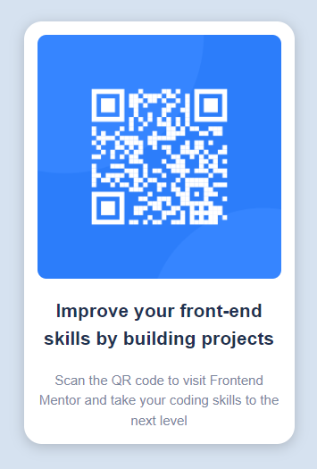

# Frontend Mentor - QR code component solution

This is my solution to the [QR code component challenge on Frontend Mentor](https://www.frontendmentor.io/challenges/qr-code-component-iux_sIO_H). Frontend Mentor challenges help you improve your coding skills by building realistic projects. 

## Table of contents

- [Overview](#overview)
  - [Screenshot](#screenshot)
  - [Links](#links)
- [My process](#my-process)
  - [Built with](#built-with)
  - [What I learned](#what-i-learned)
  - [Continued development](#continued-development)
  - [Useful resources](#useful-resources)
- [Author](#author)
- [Acknowledgments](#acknowledgments)

**Note: Delete this note and update the table of contents based on what sections you keep.**

## Overview

### Screenshot




### Links

- Solution URL: [Ahttps://caius-scipio.github.io/QR-Code-Component-Hub/](https://your-solution-url.com)

## My process

### Built with

- Semantic HTML5 markup
- w3.css
- CSS custom properties
- Mobile-first workflow

### What I learned

There's probably countless ways to solve this problem and I may have found one. When working with w3.css, it has a good starting point for common elements that I can then go in and add to or modify if needed.

I also started looking into CSS naming conventions. I used BEM today for my classes. I think it's a nice combination to quickly see if it's my CSS that is causing issues or not.

```html
<h1>Some HTML code I'm proud of</h1>

<!-- I remembered the alt tag -->


```
```css
@media (min-width: 1440px) {
    /*forced me to work mobile first*/
}
```

### Continued development

I was unable to find the Designer View in VS Code and so I was forced to eyeball this project. Proportionally, it's possibly pretty close, but I'd like to revisit this in the future with a better design.

### Useful resources

- [https://www.w3schools.com/](https://www.example.com) - This helped me to grasp what w3.css can do and provided examples that I could work from.

## Author

- Frontend Mentor - [@Caius-Scipio](https://www.frontendmentor.io/profile/yourusername)

## Acknowledgments

Thank you to the YouTuber Kevin Powell for introducing me to Frontend Mentor.